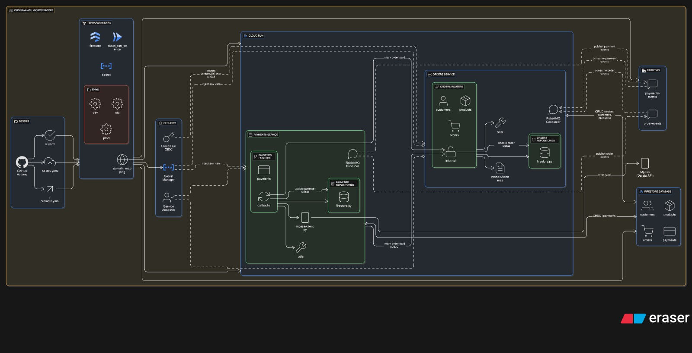

## Order Yangu 
#### Order & Payment Microservices
Order-Yangu is an e-commerce backend built with microservices. The order-service handles order creation and management, while the payment-service processes transactions. Services communicate asynchronously for scalability.



### Repository Structure
```bash
├── orders-service/          # Order management microservice
│   ├── app/
│   └── Dockerfile
│   └── run_app.sh
│   └── docker/              # Stacks yml files anf firestore Dockerfile to maintain a managed emulator eimage
│   ├── tests/
├── payments-service/        # Payment processing microservice
│   ├── app/
│   └── Dockerfile
│   └── run_app.sh
│   └── docker/              # Stacks yml files anf firestore Dockerfile to maintain a managed emulator eimage
│   ├── tests/
├── .github/
│   ├── workflows/  
├── docker-compose.yml       
├── .dockerignore
├── .gitignore
├── .design-1.png
├── LICENSE (MIT, you can fork this, for research or)
└── README.md
```

### Tech Stack
*   Framework: fast-api [python].
*   Inter-Service Communication: [REST APIs / RabbitMQ ]
*   Data Storage: Google Firestore
*   Containerization: Docker
*   Orchestration: Docker Compose (for local dev), gloud (for prod)


### Services Overview
| Service               | Port      | Description                                                                 |
| :---------------------| :---------| :-------------------------------------------------------------------------- |
| **🛒 Orders Service**    | `:8081`   | Manages the order lifecycle: creation, retrieval, and status updates.       |
| **💳 Payments Service**  | `:8082`   | Handles payment intent creation, processing, and transaction records.       |


### Local Setup
#### Prerequisites
Before you begin, ensure you have the following installed on your machine:
*   Docker
*   Docker Compose
#### Getting started
Follow these steps to get the project running on your local machine.
1. Clone the Repository 
git clone https://github.com/DerekMwirigi/order-yangu.git
2. Run with Docker Compose (Recommended)
```bash
cd <name>-service
docker compose -f docker/docker-compose.yml up -d
docker compose -f docker/docker-compose.yml down
```
3. Local Environment Setup
```bash
cd <name>-service
docker compose -f docker/firestore/docker-firestore up -d
```
This will start-up a firestore emulator container in detach mode
Setup environment variables
```cp .env.example .env```
Edit the .env file with your local configuration
*   <service_name>_FIRESTORE_EMULATOR_HOST
*   <service_name>_FIRESTORE_PROJECT_ID
e.g. ORDERS_FIRESTORE_PROJECT_ID, ORDERS_FIRESTORE_EMULATOR_HOST
```
uvicorn app.main:app --reload --port 8001 (order-service)
uvicorn app.main:app --reload --port 8002 (payment-service)
```

### API Docs
Detailed API documentation is provided via Swagger UI when the services are running
*   🛒Orders Service: http://localhost:8001/docs
*   💳 Payments Service: http://localhost:8002/docs

### Testing Services APIs
#### Order Service
1. Create an Order
```bash
curl -X POST http://localhost:8001/v1/orders/ \
  -H "Content-Type: application/json" \
  -d '{
    "customerId": "Cust-A",
    "items": [
      {"productId": "prod-456", "unitPrice": 10.0, "qty": 2}
    ],
    "currency": "KES"
  }' | jq
```
This should return an order example.
```
{
  "id": "RIGq8bEcIr6e4AH7G2yN",
  "customerId": "Cust-A",
  "items": [
    {
      "productId": "prod-456",
      "qty": 2,
      "unitPrice": 10.0
    }
  ],
  "amount": 20.0,
  "currency": "KES",
  "status": "PENDING",
  "paymentRef": null,
  "createdAt": "2025-08-26T15:23:45.892221Z",
  "updatedAt": "2025-08-26T15:23:45.892221Z"
}
```
2. Listing orders
```bash
curl -X GET http://localhost:8001/v1/orders -H "Content-Type: application/json" | jq
```
This should return list of orders, example.
```
[
  {
    "id": "vJAgBXvDAgvcbDMG0EYs",
    "customerId": "Cust-A",
    "items": [
      {
        "productId": "prod-456",
        "qty": 2,
        "unitPrice": 10.0
      }
    ],
    "amount": 20.0,
    "currency": "KES",
    "status": "PENDING",
    "paymentRef": null,
    "createdAt": "2025-08-26T15:18:47.481077Z",
    "updatedAt": "2025-08-26T15:18:47.481077Z"
  },
  {
    "id": "vJAgBXvDAgvcbDMG0EYs",
    "customerId": "Cust-A",
    "items": [
      {
        "productId": "prod-456",
        "qty": 2,
        "unitPrice": 10.0
      }
    ],
    "amount": 20.0,
    "currency": "KES",
    "status": "PENDING",
    "paymentRef": null,
    "createdAt": "2025-08-26T15:18:47.481077Z",
    "updatedAt": "2025-08-26T15:18:47.481077Z"
  }
]
```

#### Payment Service
3. Initiate Mpesa STK Push
```bash
curl -X POST http://localhost:8002/v1/payments \
  -H "Content-Type: application/json" \
  -d '{
    "orderId": "vJAgBXvDAgvcbDMG0EYs",
    "msisdn": "254706828559",
    "amount": 100.00
  }' | jq
```
This should return payment initiated response example.
```
{
  "id": "qXddGGuCrmbFHP7ZfIlq",
  "orderId": "vJAgBXvDAgvcbDMG0EYs",
  "amount": 100.0,
  "currency": "KES",
  "status": "INITIATED",
  "createdAt": "2025-08-26T15:44:49.409166Z",
  "updatedAt": "2025-08-26T15:44:49.409166Z"
}
```
4. Simulate a Mpesa Confirmation Callback
```bash
curl -X POST http://localhost:8002/v1/payments/mpesa-confirmation \
  -H "Content-Type: application/json" \
  -d '{
    "ResultCode":0,
    "ResultDesc":"Accepted",
    "TransactionType": "Pay Bill",
    "TransID":"RKTQDM7W6S",
    "TransTime":"20191122063845",
    "TransAmount":"10",
    "BusinessShortCode": "600638",
    "BillRefNumber":"cxwHWJKkbQB81tPbPWpA",
    "InvoiceNumber":"qXddGGuCrmbFHP7ZfIlq", 
    "OrgAccountBalance":"",
    "ThirdPartyTransID": "",
    "MSISDN":"25470****149",
    "FirstName":"John",
    "MiddleName":"",
    "LastName":"Doe"
  }' | jq
```
```
BillRefNumber # this is payment id
InvoiceNumber # this is order id (from order service)
```
This should return payment made success.
```
{
  "status": "SUCCESS",
  "payment": {
    "id": "cxwHWJKkbQB81tPbPWpA",
    "currency": "KES",
    "createdAt": "2025-08-26T16:18:53.552635+00:00",
    "idempotencyKey": null,
    "status": "SUCCESS",
    "orderId": "vJAgBXvDAgvcbDMG0EYs",
    "updatedAt": "2025-08-26T16:21:21.618388+00:00",
    "amount": 100.0,
    "rawWebhook": {
      "ResultCode": 0,
      "ResultDesc": "Accepted",
      "TransactionType": "Pay Bill",
      "TransID": "RKTQDM7W6S",
      "TransTime": "20191122063845",
      "TransAmount": 10.0,
      "BusinessShortCode": "600638",
      "BillRefNumber": "cxwHWJKkbQB81tPbPWpA",
      "InvoiceNumber": "qXddGGuCrmbFHP7ZfIlq",
      "OrgAccountBalance": "",
      "ThirdPartyTransID": "",
      "MSISDN": "25470****149",
      "FirstName": "John",
      "MiddleName": "",
      "LastName": "Doe"
    }
  }
}
```
### License
This project is licensed under the MIT License - see the LICENSE file for details. (Ideally you can clone!!!)
